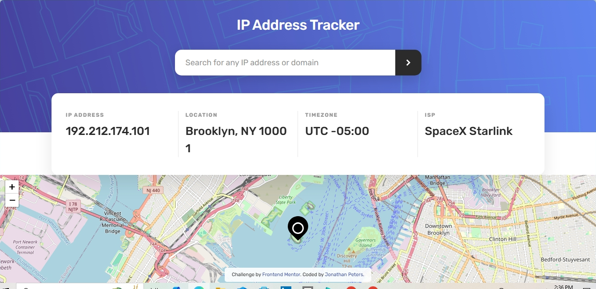

# Frontend Mentor - IP address tracker solution

This is my solution to the [IP address tracker challenge on Frontend Mentor](https://www.frontendmentor.io/challenges/ip-address-tracker-I8-0yYAH0). Frontend Mentor challenges help you improve your coding skills by building realistic projects. 

## Table of contents

- [Overview](#overview)
  - [The challenge](#the-challenge)
  - [Screenshot](#screenshot)
  - [Links](#links)
  - [Built with](#built-with)
  - [Useful resources](#useful-resources)
- [Author](#author)

## Overview

### The challenge

Users should be able to:

- View the optimal layout for each page depending on their device's screen size
- See hover states for all interactive elements on the page
- See their own IP address on the map on the initial page load
- Search for any IP addresses or domains and see the key information and location

### Screenshot

You can use a tool like [FireShot](https://getfireshot.com/) to take the screenshot. FireShot has a free option, so you don't need to purchase it. 

Then crop/optimize/edit your image however you like, add it to your project, and update the file path in the image above.

### Links

- Solution URL: [IP Address Tracker](https://github.com/QMS85/IPAddressTracker.git)
- Live Site URL: [IP Address Tracker](https://qms85.github.io/IPAddressTracker/)

### Built with

- Semantic HTML5 markup
- CSS custom properties
- Flexbox
- CSS Grid
- Mobile-first workflow

### Useful resources

- [W3Schools](https://www.w3schools.com) - Learn To Code
- [freeCodeCamp: Responsive Web Design](https://www.freecodecamp.org/learn/2022/responsive-web-design) - Learn Responsive Web Design

- My Portfolio Website - [Jonathan Peters](https://qms85.github.io/MyPortfolio/)
- Frontend Mentor - [Jonathan Peters](https://www.frontendmentor.io/profile/yourusername)
- Twitter - [@DJJonnas](https://www.twitter.com/@DJJonnas85)
- Facebook - [Jonathan Peters](https://www.facebook.com/2jonathanpeters)
- Linkedin - [Jonathan Peters](https://www.linkedin.com/in/2jonathanpeters)
